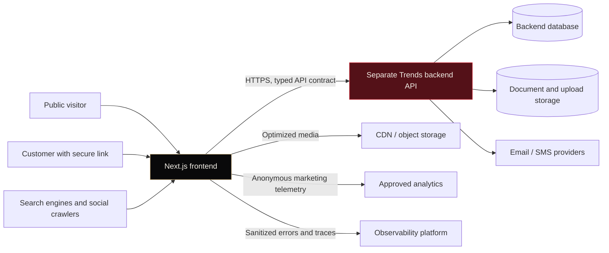
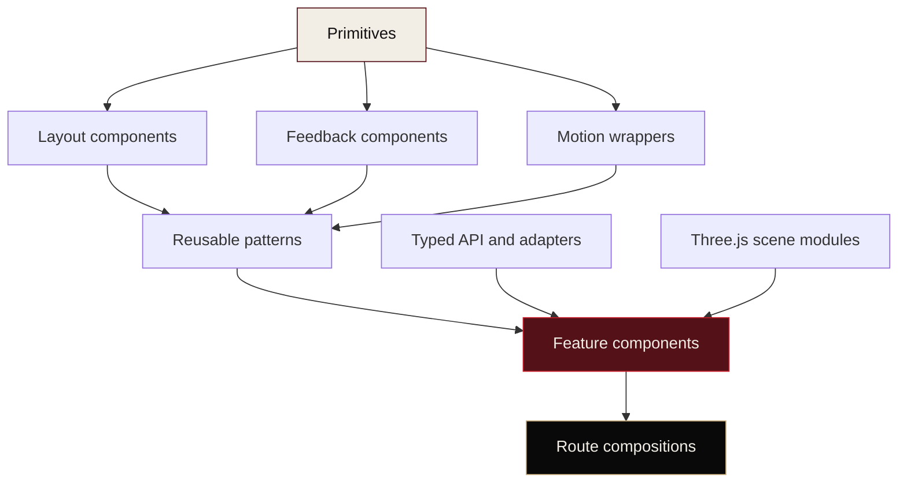
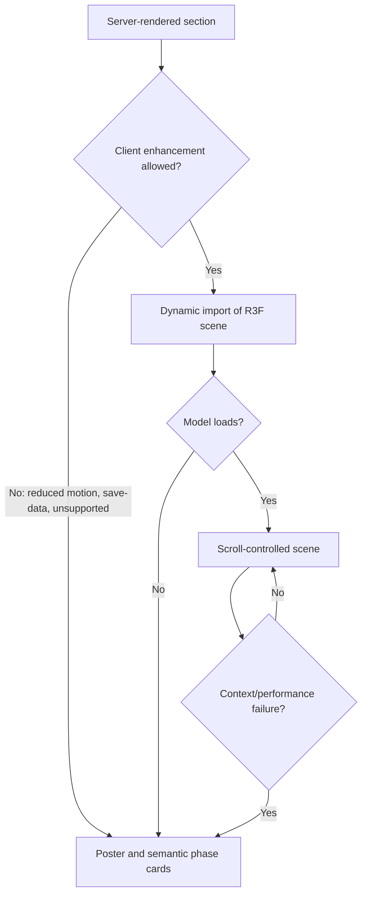
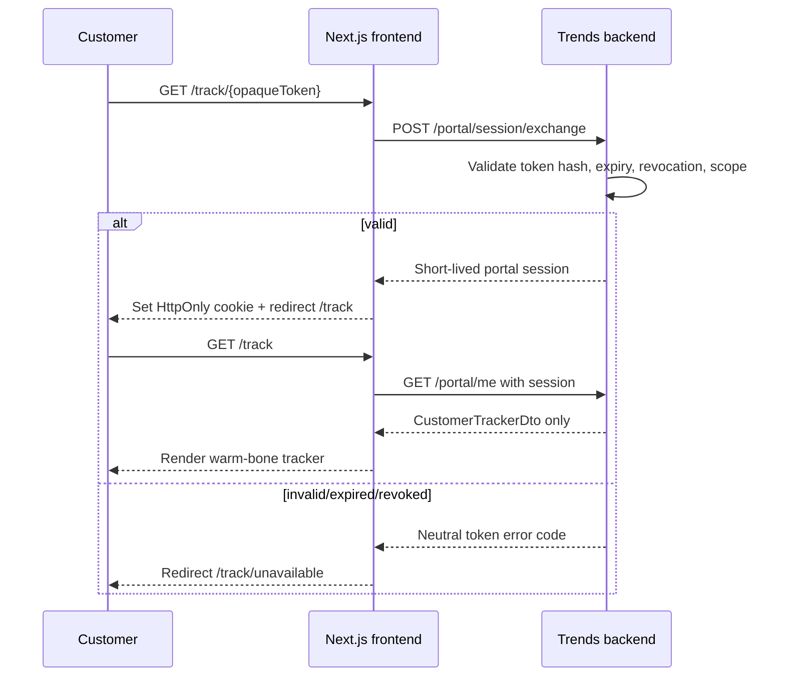

# Trends Collision Frontend Architecture

**Document:** `architecture.md`  
**Status:** Production implementation specification  
**Visual direction:** Coachbuilt After Dark with logo-led hero, Three.js process narrative, and warm-bone utility mode  
**Application type:** Standalone Next.js frontend consuming a separate backend API  
**Primary language:** TypeScript in strict mode  
**Primary UI runtime:** React with Next.js App Router  
**3D runtime:** Three.js through React Three Fiber

---

## 1. Purpose

This document defines the production frontend architecture for the Trends Collision website, customer tracker, and customer-facing forms.

It converts the approved visual design into a maintainable system with:

- Reusable components.
- Clear server/client boundaries.
- A scalable feature structure.
- Typed API contracts.
- Accessible interaction primitives.
- Deterministic motion ownership.
- Progressive Three.js enhancement.
- Loading, empty, error, offline, and fallback states.
- Responsive behavior.
- Automated quality controls.
- A clean developer experience.

The frontend and backend are separate systems. The frontend does not connect to the database, implement repair workflow rules, decide customer visibility, finalize legal documents, or persist operational records directly.

---

## 2. Architecture goals

### 2.1 Product goals

- Deliver an editorial, premium public website without sacrificing speed or accessibility.
- Make the supplied Trends logo the homepage hero focal point.
- Explain the repair story through a separate Scan → Repair → Finish Three.js section.
- Provide a clear customer repair tracker.
- Provide reliable, accessible digital forms and document requests.
- Support future content, service pages, case studies, certifications, and backend capabilities without rewriting the foundation.

### 2.2 Engineering goals

- Default to Server Components and ship client JavaScript only where interaction requires it.
- Keep pages and layouts thin.
- Keep API access behind one typed integration boundary.
- Generate frontend API types from the backend OpenAPI contract.
- Use semantic view models rather than rendering raw backend DTOs.
- Keep visual primitives independent from repair-domain features.
- Avoid global state unless state is genuinely cross-route or cross-tree.
- Code split Three.js, animation engines, forms, and other heavy client features.
- Make every enhanced experience fail safely.
- Test user-visible behavior instead of implementation details.

### 2.3 Non-goals

The frontend will not:

- Include Prisma or direct database access.
- Duplicate workflow-template logic.
- Infer which repair stages are customer-visible.
- Expose internal notes, red flags, employee names, assignments, or full activity logs to customers.
- Replace the backend’s authorization checks.
- Store final legal documents as client-only state.
- Require WebGL to understand or use the site.
- Create a separate component implementation for every route.
- Use a smooth-scroll engine that replaces native browser scrolling.
- Build the internal shop operations dashboard in this phase unless separately scoped.

---

## 3. Architecture decisions

| ID | Decision | Status | Rationale |
|---|---|---|---|
| ADR-001 | Separate frontend repository and deployment | Accepted | Keeps frontend delivery independent from the workflow backend while preserving a contract-based integration |
| ADR-002 | Next.js App Router | Accepted | Supports server-first rendering, route-level loading/error states, streaming, metadata, and code splitting |
| ADR-003 | React Server Components by default | Accepted | Reduces browser JavaScript and keeps API credentials/server fetches out of client bundles |
| ADR-004 | TypeScript strict mode | Accepted | Improves correctness across components, DTO adapters, forms, and animation state |
| ADR-005 | CSS Modules plus CSS custom-property tokens | Accepted | Custom visual identity, predictable SSR, no runtime styling dependency, and local component ownership |
| ADR-006 | React Aria Components for complex accessible primitives | Accepted | Provides accessible behavior without imposing a visual style |
| ADR-007 | CSS + Motion + GSAP tiered animation | Accepted | Uses the simplest tool for each motion class and isolates the cinematic scroll timeline |
| ADR-008 | React Three Fiber for Three.js integration | Accepted | Fits React composition and supports an isolated, dynamically loaded scene tree |
| ADR-009 | OpenAPI-generated contract types | Accepted | Prevents handwritten drift between separate frontend and backend systems |
| ADR-010 | Backend-provided customer-safe DTO | Required | The frontend must not filter internal repair-order data into a public shape |
| ADR-011 | Thin frontend BFF only for secure session exchange/proxying | Accepted with constraint | Protects portal/form tokens and SSR credentials without moving domain logic into Next.js |
| ADR-012 | Static/reduced-motion fallback is first-class | Required | Preserves content, accessibility, and conversion when enhancement is unavailable |
| ADR-013 | Storybook-driven reusable UI development | Recommended | Documents variants and edge states before route integration |

---

## 4. System context



### 4.1 Boundary rules

The frontend owns:

- Rendering.
- Route composition.
- Responsive behavior.
- Interaction behavior.
- Local form state before submission.
- Accessible presentation.
- Marketing content integration.
- API request orchestration.
- DTO-to-view-model mapping.
- Client-side optimistic or pending feedback where safe.

The backend owns:

- Authentication and authorization decisions.
- Portal-token validity, expiration, revocation, and scoping.
- Customer-safe repair-order DTO construction.
- Workflow templates and stage rules.
- Legal document templates and versions.
- Signature and document finalization.
- Upload authorization and storage policies.
- Notification delivery.
- Repair status persistence.
- Audit history.

A frontend check may improve usability, but it is never a security boundary.

---

## 5. Recommended technology stack

### 5.1 Runtime dependencies

| Package | Role |
|---|---|
| `next` | App Router, server rendering, metadata, route boundaries, image/font optimization |
| `react`, `react-dom` | UI runtime |
| `typescript` | Static types and strict contract enforcement |
| `three` | 3D engine |
| `@react-three/fiber` | React renderer for Three.js |
| `@react-three/drei` | Curated R3F helpers used selectively |
| `gsap`, `@gsap/react` | Deterministic cinematic timeline and ScrollTrigger integration |
| `motion` | Component enter/exit, layout, and standard scroll reveals |
| `react-aria-components` | Accessible unstyled interaction primitives |
| `react-hook-form` | Performant customer form state |
| `zod` | Runtime validation and form schemas |
| `@hookform/resolvers` | Zod integration for React Hook Form |
| `openapi-fetch` | Typed requests using generated OpenAPI paths |
| `@tanstack/react-query` | Client-side mutation, polling, retry, and cache control in tracker/form islands |
| `clsx` | Conditional class composition |

### 5.2 Development dependencies

| Package | Role |
|---|---|
| `openapi-typescript` | Generate TypeScript types from the backend OpenAPI schema |
| `vitest` | Unit and component-level logic tests |
| `@testing-library/react` | User-oriented React tests |
| `@testing-library/user-event` | Realistic interaction tests |
| `@playwright/test` | End-to-end and browser compatibility tests |
| `@axe-core/playwright` | Automated accessibility checks within E2E tests |
| `storybook` and framework adapter | Isolated component/state documentation |
| `eslint` and accessibility plugins | Static quality checks |
| `prettier` | Formatting |
| `husky` / `lint-staged` or equivalent | Optional staged checks |

Pin exact versions in the lockfile. Upgrade intentionally through tested dependency pull requests rather than floating runtime versions.

### 5.3 Package-manager policy

Use `pnpm` and commit `pnpm-lock.yaml`.

Recommended scripts:

```json
{
  "scripts": {
    "dev": "next dev",
    "build": "next build",
    "start": "next start",
    "typecheck": "tsc --noEmit",
    "lint": "eslint .",
    "format:check": "prettier --check .",
    "test": "vitest run",
    "test:watch": "vitest",
    "test:e2e": "playwright test",
    "test:a11y": "playwright test --grep @a11y",
    "storybook": "storybook dev",
    "storybook:build": "storybook build",
    "api:generate": "openapi-typescript ./contracts/openapi.json -o ./src/contracts/backend.generated.ts",
    "check": "pnpm typecheck && pnpm lint && pnpm test && pnpm build"
  }
}
```

---

## 6. TypeScript policy

Use strict TypeScript across application and tests.

Recommended additions beyond `strict`:

```json
{
  "compilerOptions": {
    "strict": true,
    "noUncheckedIndexedAccess": true,
    "exactOptionalPropertyTypes": true,
    "noImplicitOverride": true,
    "noFallthroughCasesInSwitch": true,
    "useUnknownInCatchVariables": true,
    "forceConsistentCasingInFileNames": true,
    "verbatimModuleSyntax": true,
    "isolatedModules": true,
    "resolveJsonModule": true,
    "noEmit": true
  }
}
```

Rules:

- Do not use `any` in application code. Use `unknown`, narrow it, or correct the contract.
- Exported component props, adapters, and API functions have explicit types.
- Model state with discriminated unions.
- Use exhaustive `switch` checks for status/state renderers.
- Do not duplicate generated API types manually.
- Generated contract files are not edited by hand.
- View models remain separate from generated transport types.

Exhaustiveness helper:

```ts
export function assertNever(value: never, message = "Unexpected value"): never {
  throw new Error(`${message}: ${JSON.stringify(value)}`)
}
```

---

## 7. Repository structure

```text
trends-frontend/
├─ .storybook/
├─ contracts/
│  └─ openapi.json
├─ public/
│  ├─ brand/
│  │  └─ trends-logo.svg
│  ├─ models/
│  │  ├─ vehicle-desktop.glb
│  │  └─ vehicle-mobile.glb
│  ├─ textures/
│  ├─ posters/
│  └─ media/
├─ src/
│  ├─ app/
│  │  ├─ (marketing)/
│  │  │  ├─ layout.tsx
│  │  │  ├─ page.tsx
│  │  │  ├─ loading.tsx
│  │  │  ├─ error.tsx
│  │  │  ├─ services/
│  │  │  ├─ certifications/
│  │  │  ├─ how-to-file-a-claim/
│  │  │  ├─ why-trends/
│  │  │  ├─ craftsmanship/
│  │  │  │  └─ [slug]/
│  │  │  ├─ about/
│  │  │  └─ contact/
│  │  ├─ (portal)/
│  │  │  ├─ layout.tsx
│  │  │  ├─ track/
│  │  │  │  ├─ page.tsx
│  │  │  │  ├─ loading.tsx
│  │  │  │  ├─ error.tsx
│  │  │  │  └─ unavailable/page.tsx
│  │  │  └─ track/[token]/route.ts
│  │  ├─ (forms)/
│  │  │  ├─ layout.tsx
│  │  │  └─ forms/
│  │  │     ├─ page.tsx
│  │  │     ├─ [token]/route.ts
│  │  │     ├─ loading.tsx
│  │  │     └─ confirmation/page.tsx
│  │  ├─ api/
│  │  │  ├─ portal/session/route.ts
│  │  │  ├─ forms/session/route.ts
│  │  │  └─ backend/[...path]/route.ts
│  │  ├─ global-error.tsx
│  │  ├─ not-found.tsx
│  │  ├─ layout.tsx
│  │  ├─ manifest.ts
│  │  ├─ robots.ts
│  │  └─ sitemap.ts
│  ├─ components/
│  │  ├─ primitives/
│  │  ├─ layout/
│  │  ├─ feedback/
│  │  ├─ brand/
│  │  └─ motion/
│  ├─ features/
│  │  ├─ marketing/
│  │  │  ├─ hero/
│  │  │  ├─ credentials/
│  │  │  ├─ vehicle-process/
│  │  │  ├─ capabilities/
│  │  │  ├─ craftsmanship/
│  │  │  └─ claim-guide/
│  │  ├─ tracker/
│  │  │  ├─ api/
│  │  │  ├─ adapters/
│  │  │  ├─ components/
│  │  │  ├─ models/
│  │  │  └─ tracker-page.tsx
│  │  └─ forms/
│  │     ├─ api/
│  │     ├─ components/
│  │     ├─ schemas/
│  │     ├─ state/
│  │     └─ form-page.tsx
│  ├─ scenes/
│  │  ├─ shared/
│  │  ├─ logo-monolith/
│  │  └─ vehicle-process/
│  ├─ contracts/
│  │  └─ backend.generated.ts
│  ├─ lib/
│  │  ├─ api/
│  │  ├─ env/
│  │  ├─ analytics/
│  │  ├─ observability/
│  │  ├─ security/
│  │  ├─ testing/
│  │  └─ utilities/
│  ├─ providers/
│  ├─ styles/
│  │  ├─ reset.css
│  │  ├─ tokens.css
│  │  ├─ themes.css
│  │  ├─ typography.css
│  │  ├─ utilities.css
│  │  └─ globals.css
│  └─ types/
├─ tests/
│  ├─ e2e/
│  ├─ fixtures/
│  └─ visual/
├─ next.config.ts
├─ playwright.config.ts
├─ tsconfig.json
└─ package.json
```

### 7.1 Folder ownership rules

- `components/primitives` has no repair-domain imports.
- `features/*` may use primitives and feature-local components.
- `app/*` composes features and handles route boundaries; it does not contain complex UI logic.
- `scenes/*` owns Three.js objects and scene-only utilities.
- `lib/api` is the only general network boundary.
- `contracts` contains transport types only.
- Feature adapters convert transport DTOs to stable view models.
- Cross-feature imports should be rare and flow through explicit public `index.ts` files.

---

## 8. Route architecture

### 8.1 Marketing routes

| Route | Rendering strategy | Notes |
|---|---|---|
| `/` | Static or revalidated | Server-rendered hero and content; client-enhanced logo and vehicle section |
| `/services` | Static/revalidated | Service index |
| `/services/[slug]` | Static/revalidated | Structured service content |
| `/certifications` | Static/revalidated | Credential content and approved links |
| `/how-to-file-a-claim` | Static/revalidated | High-readability guide |
| `/why-trends` | Static/revalidated | Capabilities, quality, process |
| `/craftsmanship` | Static/revalidated | Case-study index |
| `/craftsmanship/[slug]` | Static/revalidated | Editorial case study |
| `/about` | Static/revalidated | Brand and facility |
| `/contact` | Static plus client form island | Contact/towing/repair start |

### 8.2 Tracker routes

Recommended secure flow:

1. Customer opens `/track/[token]`.
2. Route Handler validates basic token shape and sends the opaque token to the backend exchange endpoint.
3. Backend validates hash, expiry, revocation, and repair-order scope.
4. Backend returns a short-lived portal session token or session identifier.
5. Next.js sets an `HttpOnly`, `Secure`, `SameSite=Lax` cookie.
6. Route Handler redirects to `/track`, removing the raw token from the address bar.
7. `/track` fetches a backend-generated customer-safe DTO.

The exchange route contains no repair business logic.

Tracker response headers:

- `Cache-Control: private, no-store`.
- `Referrer-Policy: no-referrer`.
- `X-Robots-Tag: noindex, nofollow`.
- Appropriate content-security and frame-ancestor restrictions.

### 8.3 Forms routes

Use the same exchange pattern for `/forms/[token]` when forms are opened through a secure link.

- Active form session lives in an HttpOnly cookie.
- Draft values are submitted to the backend, not stored as the authoritative record in local storage.
- Safe local recovery may be used only for non-sensitive drafts and only after privacy review.
- Final submission always returns a backend confirmation/reference.

### 8.4 Route groups and layouts

- `(marketing)` uses dark Coachbuilt shell and marketing header/footer.
- `(portal)` uses warm-bone utility shell and secure-route metadata.
- `(forms)` uses warm-bone form shell with reduced navigation.
- Root layout owns fonts, global tokens, skip link, telemetry provider, and global announcements.
- Avoid placing request-specific API calls in shared layouts when that would block loading boundaries.

---

## 9. Server and Client Component strategy

### 9.1 Default rule

All components are Server Components unless they need:

- Browser APIs.
- Event handlers.
- Local state.
- React context.
- Motion runtime.
- Three.js canvas.
- Form state.
- Client-side polling or mutation.

### 9.2 Server Component responsibilities

- Route composition.
- Marketing content fetches.
- SEO metadata.
- Initial tracker DTO fetch.
- Initial form schema/template fetch.
- Safe API credentials and server cookies.
- Static content and image composition.
- Error/not-found routing decisions.
- Rendering non-interactive component shells.

### 9.3 Client Component responsibilities

- Navigation sheet.
- Dialog, popover, tabs, accordions where interactive.
- Contact form.
- Tracker refresh island if enabled.
- Document form state.
- File upload.
- Signature and damage diagram.
- Motion-enhanced sections.
- Three.js scenes.
- Analytics events triggered by actual interaction.

### 9.4 Boundary guidance

Bad:

```tsx
"use client"

export default function MarketingPage() {
  // Entire page, content, images, and layout now enter the client graph.
}
```

Preferred:

```tsx
import { LogoHero } from "@/features/marketing/hero/logo-hero"
import { VehicleProcessClient } from "@/features/marketing/vehicle-process/vehicle-process-client"
import { CapabilitiesSection } from "@/features/marketing/capabilities/capabilities-section"

export default async function HomePage() {
  const content = await getHomeContent()

  return (
    <>
      <LogoHero content={content.hero} />
      <VehicleProcessClient content={content.process} />
      <CapabilitiesSection items={content.capabilities} />
    </>
  )
}
```

Only `VehicleProcessClient` and the small enhanced portion of `LogoHero` need a client boundary.

---

## 10. Component architecture



### 10.1 Layer definitions

#### Primitives

Small, reusable, accessible controls and surfaces:

- Button.
- LinkButton.
- TextField.
- Select.
- Checkbox.
- RadioGroup.
- Dialog.
- Tabs.
- Tooltip.
- InlineAlert.
- Skeleton.

Primitives know design tokens but not repair-order semantics.

#### Layout

Composition helpers:

- Container.
- Section.
- Stack.
- Cluster.
- Grid.
- Bleed.
- StickyStage.

#### Patterns

Reusable multi-primitive arrangements:

- SectionHeading.
- FormField.
- FormErrorSummary.
- CTAFrame.
- MediaFrame.
- EmptyState.
- AsyncState.

#### Features

Domain-aware experiences:

- LogoHero.
- VehicleProcessStory.
- CredentialRail.
- TrackerTimeline.
- CurrentRepairStatus.
- DocumentRequestList.
- IntakeForm.
- SignatureStep.

#### Routes

Routes fetch and compose. They should not define one-off visual systems.

---

## 11. Component API design rules

### 11.1 General rules

- Prefer explicit variants over unrestricted style props.
- Accept `className` as an escape hatch, but do not expose raw internal class names.
- Use semantic HTML defaults.
- Separate buttons from links; do not create a single component that guesses semantics from `href` unless the API remains unambiguous.
- Controlled and uncontrolled modes are documented for form-like components.
- Event props use standard React/React Aria naming.
- Boolean prop names begin with `is`, `has`, `should`, or `allow`.
- Avoid props that accept arbitrary CSS values when a token/variant is sufficient.
- Every component documents its empty, loading, disabled, error, and long-content behavior where relevant.

### 11.2 Composition over configuration

Avoid a single card with dozens of optional props.

Bad:

```tsx
<UniversalCard
  image="..."
  title="..."
  subtitle="..."
  eyebrow="..."
  buttonLabel="..."
  buttonHref="..."
  trackerStatus="..."
  isCaseStudy
  isTracker
  isDark
/>
```

Preferred:

```tsx
<CaseStudyCard href="/craftsmanship/camry-quarter-panel">
  <CaseStudyCard.Media image={image} />
  <CaseStudyCard.Content>
    <CaseStudyCard.Meta>Collision repair · Honda certified</CaseStudyCard.Meta>
    <CaseStudyCard.Title>Factory form, restored.</CaseStudyCard.Title>
  </CaseStudyCard.Content>
</CaseStudyCard>
```

### 11.3 Discriminated unions for state

```ts
export type AsyncState<T> =
  | { status: "idle" }
  | { status: "loading" }
  | { status: "success"; data: T; isStale?: boolean }
  | { status: "empty"; reason?: string }
  | { status: "error"; error: AppError; canRetry: boolean }
```

This prevents impossible combinations such as `isLoading`, `hasError`, and `data` all being active together.

---

## 12. Primitive component examples

### 12.1 Button

```tsx
// src/components/primitives/button/button.tsx
"use client"

import { forwardRef } from "react"
import {
  Button as AriaButton,
  type ButtonProps as AriaButtonProps,
} from "react-aria-components"
import clsx from "clsx"
import styles from "./button.module.css"

export type ButtonVariant = "primary" | "secondary" | "quiet" | "danger"
export type ButtonSize = "sm" | "md" | "lg"

export interface ButtonProps extends Omit<AriaButtonProps, "className"> {
  variant?: ButtonVariant
  size?: ButtonSize
  className?: string
  isPending?: boolean
  pendingLabel?: string
}

export const Button = forwardRef<HTMLButtonElement, ButtonProps>(
  function Button(
    {
      variant = "primary",
      size = "md",
      className,
      isPending = false,
      pendingLabel = "Working…",
      children,
      isDisabled,
      ...props
    },
    ref,
  ) {
    return (
      <AriaButton
        {...props}
        ref={ref}
        isDisabled={isDisabled || isPending}
        aria-busy={isPending || undefined}
        data-variant={variant}
        data-size={size}
        className={clsx(styles.root, className)}
      >
        {isPending ? pendingLabel : children}
      </AriaButton>
    )
  },
)
```

```css
/* button.module.css */
.root {
  min-block-size: 2.75rem;
  padding-inline: 1.125rem;
  border: 1px solid transparent;
  border-radius: var(--radius-pill);
  font: 700 var(--font-size-0) / 1 var(--font-ui);
  transition:
    transform var(--duration-fast) var(--ease-standard),
    background-color var(--duration-fast) var(--ease-standard),
    border-color var(--duration-fast) var(--ease-standard);
}

.root[data-size="lg"] {
  min-block-size: 3rem;
  padding-inline: 1.375rem;
}

.root[data-variant="primary"] {
  color: #fff;
  background: var(--color-brand-red);
}

.root[data-variant="secondary"] {
  color: var(--text-primary-on-dark);
  border-color: var(--border-on-dark);
  background: transparent;
}

.root[data-hovered] {
  transform: translateY(-2px);
}

.root[data-pressed] {
  transform: translateY(0);
}

.root[data-focus-visible] {
  outline: none;
  box-shadow: var(--shadow-focus);
}

.root[data-disabled] {
  cursor: not-allowed;
  opacity: 0.58;
  transform: none;
}

@media (prefers-reduced-motion: reduce) {
  .root { transition: none; }
  .root[data-hovered] { transform: none; }
}
```

### 12.2 GlowFrame

```tsx
// src/components/motion/glow-frame/glow-frame.tsx
import type { ComponentPropsWithoutRef, ElementType, ReactNode } from "react"
import clsx from "clsx"
import styles from "./glow-frame.module.css"

type GlowFrameProps<T extends ElementType> = {
  as?: T
  children: ReactNode
  intensity?: "subtle" | "standard"
  animateOn?: "hover" | "reveal" | "focus-within"
  className?: string
} & Omit<ComponentPropsWithoutRef<T>, "as" | "children" | "className">

export function GlowFrame<T extends ElementType = "div">({
  as,
  children,
  intensity = "standard",
  animateOn = "hover",
  className,
  ...props
}: GlowFrameProps<T>) {
  const Component = as ?? "div"

  return (
    <Component
      {...props}
      className={clsx(styles.root, className)}
      data-intensity={intensity}
      data-animate-on={animateOn}
    >
      {children}
    </Component>
  )
}
```

The glow is decorative. The component must not replace a focus ring or selected-state label.

### 12.3 SectionReveal

```tsx
// src/components/motion/section-reveal/section-reveal.tsx
"use client"

import type { ReactNode } from "react"
import { motion, useReducedMotion } from "motion/react"

export interface SectionRevealProps {
  children: ReactNode
  delay?: number
  distance?: number
  once?: boolean
}

export function SectionReveal({
  children,
  delay = 0,
  distance = 20,
  once = true,
}: SectionRevealProps) {
  const shouldReduceMotion = useReducedMotion()

  if (shouldReduceMotion) return <>{children}</>

  return (
    <motion.div
      initial={{ opacity: 0, y: distance }}
      whileInView={{ opacity: 1, y: 0 }}
      viewport={{ once, amount: 0.2 }}
      transition={{
        duration: 0.7,
        delay,
        ease: [0.22, 1, 0.36, 1],
      }}
    >
      {children}
    </motion.div>
  )
}
```

Do not wrap entire pages in this component. Apply it to deliberate editorial groups.

---

## 13. API contract architecture

### 13.1 OpenAPI as the integration source of truth

The backend publishes an OpenAPI 3.0/3.1 document.

CI workflow:

1. Fetch or copy the approved backend schema into `contracts/openapi.json`.
2. Validate the schema.
3. Generate `src/contracts/backend.generated.ts`.
4. Run TypeScript and adapter tests.
5. Fail the pull request when the backend contract introduces an unhandled breaking change.

Generated types are transport types, not component props.

### 13.2 API clients

Create separate server and browser entry points.

```ts
// src/lib/api/create-api-client.ts
import createClient from "openapi-fetch"
import type { paths } from "@/contracts/backend.generated"

export interface ApiClientOptions {
  baseUrl: string
  headers?: HeadersInit
  fetch?: typeof globalThis.fetch
}

export function createApiClient({
  baseUrl,
  headers,
  fetch = globalThis.fetch,
}: ApiClientOptions) {
  return createClient<paths>({
    baseUrl,
    headers,
    fetch,
  })
}
```

```ts
// src/lib/api/server-api.ts
import "server-only"
import { cookies, headers } from "next/headers"
import { createApiClient } from "./create-api-client"
import { env } from "@/lib/env/server"

export async function getServerApi() {
  const cookieStore = await cookies()
  const incomingHeaders = await headers()
  const portalSession = cookieStore.get("trends_portal_session")?.value
  const requestId = incomingHeaders.get("x-request-id") ?? crypto.randomUUID()

  return createApiClient({
    baseUrl: env.BACKEND_API_ORIGIN,
    headers: {
      "x-request-id": requestId,
      ...(portalSession
        ? { authorization: `Bearer ${portalSession}` }
        : {}),
    },
  })
}
```

Browser components should prefer same-origin presentation endpoints when secure cookies or token redaction are required.

### 13.3 Standard error model

Normalize transport errors into a frontend error type.

```ts
export type AppErrorCode =
  | "VALIDATION"
  | "UNAUTHORIZED"
  | "FORBIDDEN"
  | "NOT_FOUND"
  | "TOKEN_INVALID"
  | "TOKEN_EXPIRED"
  | "TOKEN_REVOKED"
  | "CONFLICT"
  | "RATE_LIMITED"
  | "NETWORK"
  | "TIMEOUT"
  | "SERVER"
  | "UNKNOWN"

export interface AppError {
  code: AppErrorCode
  message: string
  fieldErrors?: Record<string, string[]>
  requestId?: string
  retryAfterSeconds?: number
}
```

User-facing components should not render raw backend messages. Map codes to approved copy.

### 13.4 Request behavior

- Set an explicit timeout using `AbortSignal.timeout` or a controlled abort helper.
- Retry idempotent reads only when failure is likely transient.
- Do not automatically retry form submissions that may have succeeded.
- Use idempotency keys for final submission if the backend supports them.
- Include request IDs for support and tracing.
- Never include portal tokens or sensitive form values in logs.

---

## 14. DTOs and view models

### 14.1 Customer tracker transport shape

The backend must return a purpose-built safe DTO. A representative contract might be:

```ts
export interface CustomerTrackerDto {
  repairOrderLabel: string
  vehicle: {
    year: number
    make: string
    model: string
    color?: string | null
  }
  currentStatus: {
    code: string
    publicLabel: string
    publicSummary: string
    updatedAt: string
    estimatedCompletionAt?: string | null
  }
  stages: Array<{
    id: string
    publicLabel: string
    state: "COMPLETE" | "CURRENT" | "UPCOMING"
    completedAt?: string | null
  }>
  documentRequests: Array<{
    id: string
    type: string
    title: string
    description?: string | null
    dueAt?: string | null
    actionUrl: string
  }>
  pickup?: {
    isReady: boolean
    instructions?: string | null
  } | null
  support: {
    phone: string
    email?: string | null
  }
}
```

It must not contain internal notes or fields that are merely hidden by CSS.

### 14.2 View-model adapter

```ts
// src/features/tracker/adapters/to-tracker-view-model.ts
import { assertNever } from "@/lib/utilities/assert-never"

export type TimelineState = "complete" | "current" | "upcoming"

export interface TrackerViewModel {
  repairOrderLabel: string
  vehicleLabel: string
  currentStatus: {
    label: string
    summary: string
    updatedAtIso: string
    tone: "current" | "ready"
  }
  stages: Array<{
    id: string
    label: string
    state: TimelineState
    completedAtIso?: string
  }>
  documentRequests: Array<{
    id: string
    title: string
    description?: string
    href: string
    dueAtIso?: string
  }>
  isPickupReady: boolean
  pickupInstructions?: string
  supportPhone: string
}

function mapStageState(
  state: "COMPLETE" | "CURRENT" | "UPCOMING",
): TimelineState {
  switch (state) {
    case "COMPLETE": return "complete"
    case "CURRENT": return "current"
    case "UPCOMING": return "upcoming"
    default: return assertNever(state)
  }
}
```

Adapters provide a stable UI API even when the backend transport evolves.

---

## 15. Data-fetching strategy

### 15.1 Marketing content

- Prefer static generation or revalidation through the selected CMS/content source.
- Use tag/path revalidation when content changes.
- Fetch content in Server Components.
- Avoid a client-side CMS SDK on public routes.
- Ensure metadata and structured data are generated server-side.

### 15.2 Tracker

- Initial fetch occurs server-side with `cache: "no-store"`.
- Optional client refresh is isolated to a small tracker-refresh component.
- Suggested refresh interval: 60–120 seconds while visible and online, subject to backend capacity and product approval.
- Pause polling when the tab is hidden.
- Do not poll after pickup completion unless required.
- Show data freshness rather than animating the timeline repeatedly.

### 15.3 Forms

- Initial template and saved draft are fetched server-side.
- Client owns temporary editing state.
- Autosave uses debounced mutations and an explicit revision/version identifier.
- Final submit returns authoritative backend status.
- File uploads use backend-issued presigned upload URLs where supported.

### 15.4 React Query scope

Use TanStack Query only inside interactive data islands. Do not wrap the entire marketing site in a global data cache without need.

Recommended query defaults:

```ts
const queryClient = new QueryClient({
  defaultOptions: {
    queries: {
      staleTime: 30_000,
      retry(failureCount, error) {
        if (isClientError(error)) return false
        return failureCount < 1
      },
      refetchOnReconnect: true,
      refetchOnWindowFocus: false,
    },
    mutations: {
      retry: false,
    },
  },
})
```

Tracker queries may opt into `refetchOnWindowFocus` when approved.

---

## 16. State-management strategy

### 16.1 State categories

| State | Owner |
|---|---|
| URL/search/filter state | Next.js route/search params |
| Server data | Server Components or TanStack Query island |
| Form editing state | React Hook Form |
| Component interaction | Local React state / React Aria state |
| Motion preference | Small context provider plus system media query |
| Three.js frame progress | Imperative ref controlled by ScrollTrigger |
| Cross-route identity/session | Secure cookie managed by server/backend |

### 16.2 Avoid global stores by default

Do not add Redux or a broad global store for:

- Open menu state.
- One form.
- One process section.
- Marketing content.
- Tracker DTOs already owned by the route/query.

A small store may be introduced only when multiple unrelated client subtrees must share frequently updated state and a simpler composition is not viable.

### 16.3 High-frequency animation state

Do not put scroll progress into React state at 60fps. Use refs or animation-library values and invalidate the canvas explicitly.

---

## 17. Motion architecture

### 17.1 Ownership matrix

| Behavior | Owner |
|---|---|
| Button hover/press | CSS |
| Metallic border pass | CSS, optional Motion trigger |
| Dialog/accordion enter/exit | Motion |
| Section reveal | Motion |
| Hero introduction | GSAP in a small client enhancement, or CSS when sufficient |
| Vehicle process pin/scrub | GSAP ScrollTrigger |
| Camera/material/light interpolation | R3F scene director |

### 17.2 Motion provider

```ts
export type MotionMode = "system" | "full" | "reduced"

export interface MotionPreferences {
  mode: MotionMode
  shouldReduce: boolean
  setMode(mode: MotionMode): void
}
```

Resolution:

- `reduced` always reduces.
- `full` enables optional motion except where device capability blocks it.
- `system` follows `prefers-reduced-motion`.

Persist only the user-selected mode, not sensitive information.

### 17.3 GSAP lifecycle

- Register plugins in a client-only module.
- Use `useGSAP` or `gsap.context` for cleanup.
- Use `gsap.matchMedia` for desktop/mobile/reduced-motion branches.
- Kill ScrollTriggers on unmount.
- Refresh after fonts and scene dimensions stabilize, not on every render.
- Do not combine ScrollSmoother or another wheel interception layer with native page scroll.

---

## 18. Three.js architecture

### 18.1 Progressive-enhancement boundary



The semantic section and poster are the baseline. The canvas is replaceable.

### 18.2 Client entry point

```tsx
// src/features/marketing/vehicle-process/vehicle-process-client.tsx
"use client"

import dynamic from "next/dynamic"
import type { VehicleProcessContent } from "./vehicle-process.types"
import { ScenePoster } from "./scene-poster"

const VehicleProcessEnhanced = dynamic(
  () => import("./vehicle-process-enhanced").then((m) => m.VehicleProcessEnhanced),
  {
    ssr: false,
    loading: () => <ScenePoster state="loading" />,
  },
)

export interface VehicleProcessClientProps {
  content: VehicleProcessContent
}

export function VehicleProcessClient({ content }: VehicleProcessClientProps) {
  return <VehicleProcessEnhanced content={content} />
}
```

A capability gate inside the enhanced component should render the static version before importing or mounting the canvas when appropriate. For maximum savings, capability detection can be split into a tiny loader component.

### 18.3 Scene tree

```text
<VehicleSceneCanvas>
  <Suspense>
    <StudioEnvironment />
    <VehicleRig>
      <VehicleModel />
      <DamageHighlights />
      <PanelGuides />
    </VehicleRig>
    <SceneDirector progressRef={progressRef} />
  </Suspense>
</VehicleSceneCanvas>
```

### 18.4 Scroll progress without React rerenders

```tsx
// simplified architecture example
"use client"

import { useRef } from "react"
import { Canvas, type RootState } from "@react-three/fiber"
import { useGSAP } from "@gsap/react"
import gsap from "gsap"
import { ScrollTrigger } from "gsap/ScrollTrigger"

gsap.registerPlugin(ScrollTrigger, useGSAP)

export function VehicleProcessEnhanced() {
  const sectionRef = useRef<HTMLElement>(null)
  const progressRef = useRef(0)
  const invalidateRef = useRef<RootState["invalidate"] | null>(null)

  useGSAP(
    () => {
      const mm = gsap.matchMedia()

      mm.add(
        {
          desktop: "(min-width: 1024px) and (prefers-reduced-motion: no-preference)",
          compact: "(max-width: 1023px) and (prefers-reduced-motion: no-preference)",
          reduced: "(prefers-reduced-motion: reduce)",
        },
        (context) => {
          if (context.conditions?.reduced) return

          const trigger = ScrollTrigger.create({
            trigger: sectionRef.current,
            start: "top top",
            end: context.conditions?.desktop ? "+=320%" : "+=180%",
            pin: Boolean(context.conditions?.desktop),
            scrub: 0.6,
            onUpdate(self) {
              progressRef.current = self.progress
              invalidateRef.current?.()
            },
          })

          return () => trigger.kill()
        },
      )

      return () => mm.revert()
    },
    { scope: sectionRef },
  )

  return (
    <section ref={sectionRef}>
      <Canvas
        frameloop="demand"
        dpr={[1, 1.75]}
        gl={{
          antialias: false,
          alpha: true,
          powerPreference: "high-performance",
        }}
        onCreated={({ invalidate }) => {
          invalidateRef.current = invalidate
        }}
      >
        <SceneDirector progressRef={progressRef} />
      </Canvas>
    </section>
  )
}
```

The real component must also include semantic phase content, capability gating, error boundaries, and a poster.

### 18.5 Scene interpolation

Use pure functions to derive phase-local progress.

```ts
export function segmentProgress(
  progress: number,
  start: number,
  end: number,
): number {
  if (progress <= start) return 0
  if (progress >= end) return 1
  return (progress - start) / (end - start)
}
```

Suggested global ranges:

- Establish: `0.00–0.12`.
- Scan: `0.12–0.38`.
- Repair: `0.38–0.72`.
- Finish: `0.72–0.93`.
- Quality settle: `0.93–1.00`.

Use easing within each segment. Do not encode narrative logic across many component-local effects.

### 18.6 Model pipeline

1. Prepare model in Blender or approved DCC tool.
2. Remove unseen geometry and unnecessary interior detail.
3. Separate only panels that animate.
4. Apply meaningful node names.
5. Bake or simplify materials where possible.
6. Export glTF 2.0/GLB.
7. Use Meshopt or Draco geometry compression after testing decode tradeoffs.
8. Convert eligible textures to KTX2/Basis Universal.
9. Create desktop and reduced-detail variants.
10. Validate in target browsers and representative mobile devices.
11. Record asset budget in source control.

Recommended node naming:

```text
VehicleRoot
├─ Body_Main
├─ Panel_Hood
├─ Panel_Fender_FL
├─ Panel_Door_FL
├─ Wheel_FL
├─ Wheel_FR
├─ Wheel_RL
├─ Wheel_RR
├─ Glass
├─ Lights_Front
└─ Lights_Rear
```

### 18.7 Rendering tiers

| Tier | Detection | Features |
|---|---|---|
| Static | Reduced motion, save-data, WebGL unavailable, explicit user choice | Poster or image sequence only |
| Low | Narrow screen, low memory, slow initialization | Lower-detail model, no post-processing, reduced DPR, simple lights |
| Standard | Typical laptop/tablet | Full model, controlled environment, DPR cap, no expensive continuous effects |
| High | Strong desktop GPU and viewport | Optional subtle depth of field/reflection enhancement after measurement |

Do not rely on user-agent sniffing alone. Prefer capability, viewport, connection, memory, and measured-frame heuristics.

### 18.8 Lifecycle and memory

- Pause updates when the scene is outside the viewport.
- Use `frameloop="demand"` where the scene is scroll-driven and settles.
- Stop work when `document.visibilityState !== "visible"`.
- Dispose custom render targets, materials, and textures owned by the component.
- Understand cache ownership before clearing `useGLTF` assets.
- Listen for `webglcontextlost` and prevent repeated crash loops.
- Do not mount multiple full Three.js canvases on the homepage.

### 18.9 Scene error boundary

Create a client error boundary specifically around the enhanced scene. It should:

- Replace the canvas with `ScenePoster`.
- Preserve phase copy and CTA.
- Log the error without model URLs containing signed credentials.
- Avoid retry loops.
- Offer a manual `Try 3D view again` only when a retry is likely safe.

---

## 19. Logo hero architecture

### 19.1 Baseline

The baseline hero is a Server Component with:

- Inline or imported SVG logo.
- Semantic headline and copy.
- Server-rendered CTAs.
- Static background/material layers.

### 19.2 Enhancement

A small dynamic client component may add:

- A shallow 3D metallic duplicate.
- One-time light choreography.
- Fine-pointer light movement.

Enhancement rules:

- Load after core hero content.
- Crossfade without changing layout.
- Disable on reduced motion, save-data, low tier, or narrow mobile.
- No independent full Three.js dependency if the process scene chunk can be reused efficiently; measure whether shared or separate chunks are smaller in practice.
- Never make navigation or CTA interaction wait for the enhancement.

---

## 20. Tracker architecture

### 20.1 Secure request lifecycle



### 20.2 Privacy rules

- Never fetch internal repair-order detail for the customer route.
- Never send internal fields to the browser and rely on hiding them.
- Redact token and session values from analytics, request logs, and error breadcrumbs.
- Do not put customer names, VINs, claim numbers, or repair details in page titles or Open Graph metadata.
- Portal pages are noindex and no-store.
- Do not load advertising or unnecessary third-party scripts on tracker/forms routes.

### 20.3 Tracker page composition

```tsx
// conceptual server component
import { notFound, redirect } from "next/navigation"
import { getServerApi } from "@/lib/api/server-api"
import { toTrackerViewModel } from "@/features/tracker/adapters/to-tracker-view-model"
import { TrackerPage } from "@/features/tracker/tracker-page"

export default async function TrackPage() {
  const api = await getServerApi()
  const { data, error, response } = await api.GET("/portal/me")

  if (response.status === 401) redirect("/track/unavailable")
  if (response.status === 404) notFound()
  if (error || !data) throw new Error("Could not load tracker")

  return <TrackerPage model={toTrackerViewModel(data)} />
}
```

### 20.4 Tracker component API

```ts
export interface TrackerTimelineItem {
  id: string
  label: string
  state: "complete" | "current" | "upcoming"
  completedAtIso?: string
}

export interface TrackerTimelineProps {
  items: readonly TrackerTimelineItem[]
  ariaLabel?: string
}
```

Implementation requirements:

- Render an ordered list.
- Use `aria-current="step"` for the current item.
- Include visible text for completed/current state.
- Handle zero, one, and many stages.
- Do not assume stage order from a hardcoded frontend enum.

### 20.5 Tracker refresh

If real-time updates are desired:

- Start with background polling, not WebSockets.
- Refetch only while visible and online.
- Announce significant changes with a polite, user-controlled message rather than every poll.
- Preserve scroll position.
- Do not animate the entire timeline on every refresh.

---

## 21. Forms architecture

### 21.1 Form definition boundary

The backend owns:

- Form/document type.
- Legal text.
- Template version.
- Required fields.
- Existing draft.
- Finalization rules.
- Submission status.

The frontend owns:

- Accessible field rendering.
- Step presentation.
- Immediate client validation that mirrors but does not replace backend validation.
- Draft/pending feedback.
- Upload and signature interaction.
- Error recovery.

### 21.2 Form schemas

Use Zod for client and adapter validation. The backend remains authoritative.

```ts
import { z } from "zod"

export const customerContactSchema = z.object({
  firstName: z.string().trim().min(1, "Enter your first name."),
  lastName: z.string().trim().min(1, "Enter your last name."),
  email: z.string().trim().email("Enter a valid email address.").optional().or(z.literal("")),
  phone: z.string().trim().min(10, "Enter a valid phone number."),
  preferredContact: z.enum(["PHONE", "TEXT", "EMAIL"]),
})

export type CustomerContactInput = z.input<typeof customerContactSchema>
export type CustomerContactOutput = z.output<typeof customerContactSchema>
```

Do not hardcode legal authorization wording into Zod schemas or frontend components.

### 21.3 Form component example

```tsx
"use client"

import { useForm } from "react-hook-form"
import { zodResolver } from "@hookform/resolvers/zod"
import {
  customerContactSchema,
  type CustomerContactInput,
  type CustomerContactOutput,
} from "../schemas/customer-contact.schema"

export interface CustomerContactStepProps {
  defaultValues: CustomerContactInput
  onSubmit(values: CustomerContactOutput): Promise<void>
}

export function CustomerContactStep({
  defaultValues,
  onSubmit,
}: CustomerContactStepProps) {
  const form = useForm<
    CustomerContactInput,
    unknown,
    CustomerContactOutput
  >({
    resolver: zodResolver(customerContactSchema),
    defaultValues,
    mode: "onBlur",
  })

  const submit = form.handleSubmit(async (values) => {
    await onSubmit(values)
  })

  return (
    <form noValidate onSubmit={submit} aria-busy={form.formState.isSubmitting}>
      {/* Shared Field/TextField components render labels and errors. */}
      <button type="submit" disabled={form.formState.isSubmitting}>
        {form.formState.isSubmitting ? "Saving…" : "Save and continue"}
      </button>
    </form>
  )
}
```

### 21.4 Server validation mapping

Backend validation errors should map to fields when possible and to a summary otherwise.

```ts
function applyServerErrors(
  error: AppError,
  setError: UseFormSetError<CustomerContactInput>,
) {
  if (!error.fieldErrors) {
    setError("root.server", { message: friendlyMessageFor(error) })
    return
  }

  for (const [field, messages] of Object.entries(error.fieldErrors)) {
    if (!isCustomerContactField(field)) continue
    setError(field, { type: "server", message: messages[0] })
  }
}
```

### 21.5 Autosave

- Debounce after meaningful idle time, not every keystroke.
- Do not autosave incomplete signatures or active canvas strokes.
- Include draft version/revision to detect conflicts.
- Show non-blocking save status.
- Retry only safe draft writes.
- On conflict, fetch latest draft and provide a clear recovery choice.

### 21.6 File upload

Recommended lifecycle:

1. Client validates basic size/type.
2. Frontend requests upload authorization from backend.
3. Browser uploads directly to approved storage using a presigned URL.
4. Frontend confirms upload with backend.
5. Backend performs scanning/validation and returns status.
6. UI shows processing, accepted, rejected, retry, or remove states.

Do not treat successful object-storage upload as successful document attachment until backend confirmation completes.

### 21.7 Signature

- Signature component is client-only.
- Store vector/point data or an approved artifact format plus metadata through backend APIs.
- Provide clear and undo controls.
- Include a typed acknowledgement alternative when approved.
- Do not finalize automatically when a stroke is present.
- Final submit requires explicit review/acknowledgement.

### 21.8 Damage diagram

Represent marks as structured data:

```ts
export interface DamageMark {
  id: string
  x: number
  y: number
  type: "DENT" | "SCRATCH" | "CRACK" | "OTHER"
  description?: string
}
```

Coordinates should be normalized from 0 to 1 so the diagram remains responsive.

---

## 22. Loading, empty, and error architecture

### 22.1 Route boundaries

Each dynamic route group includes:

- `loading.tsx` for meaningful immediate feedback.
- `error.tsx` for recoverable unexpected errors.
- `not-found.tsx` where absence is a valid route result.
- Explicit expected-error rendering for token, validation, and authorization states.

Do not throw expected validation failures into a generic error boundary.

### 22.2 AsyncBoundary pattern

```tsx
interface AsyncBoundaryProps<T> {
  state: AsyncState<T>
  loading: React.ReactNode
  empty: React.ReactNode
  error(error: AppError, retry?: () => void): React.ReactNode
  children(data: T, isStale: boolean): React.ReactNode
  retry?: () => void
}

export function AsyncBoundary<T>({
  state,
  loading,
  empty,
  error,
  children,
  retry,
}: AsyncBoundaryProps<T>) {
  switch (state.status) {
    case "idle":
    case "loading":
      return loading
    case "empty":
      return empty
    case "error":
      return error(state.error, state.canRetry ? retry : undefined)
    case "success":
      return children(state.data, state.isStale ?? false)
    default:
      return assertNever(state)
  }
}
```

Use this for client islands. Server routes use Suspense and route boundaries.

### 22.3 Error copy registry

Centralize approved public error messages by `AppErrorCode` and context. Do not scatter string comparisons across components.

### 22.4 Offline behavior

- Marketing pages remain readable from browser cache where available.
- Tracker displays the last safe status only if product/privacy policy permits and labels it with its last-updated time.
- Forms preserve active in-memory values and clearly show that saving is paused.
- Final submission is not queued silently unless the product explicitly adopts an offline transaction design.

---

## 23. Responsive architecture

### 23.1 CSS-first adaptation

- Use CSS Grid, Flexbox, `clamp`, logical properties, and container queries.
- JavaScript breakpoint logic is reserved for behavior that cannot be expressed in CSS, such as selecting a different animation timeline or loading a lower-detail model.
- Keep breakpoint constants in one module when JavaScript needs them.

```ts
export const mediaQueries = {
  compact: "(max-width: 479px)",
  mobile: "(max-width: 767px)",
  tablet: "(max-width: 1023px)",
  desktop: "(min-width: 1024px)",
  finePointer: "(hover: hover) and (pointer: fine)",
  reducedMotion: "(prefers-reduced-motion: reduce)",
} as const
```

### 23.2 Component container queries

```css
.cardGrid {
  container-type: inline-size;
}

.capabilityCard {
  display: grid;
  gap: var(--space-5);
}

@container (min-width: 42rem) {
  .capabilityCard {
    grid-template-columns: minmax(0, 0.9fr) minmax(0, 1.1fr);
    align-items: center;
  }
}
```

### 23.3 Mobile utility rules

- Form controls at least 48px high by default.
- Bottom action bar accounts for safe-area insets.
- Never place tracker stage labels in a horizontal scroll strip on compact screens.
- Avoid fixed-height content behind the mobile keyboard.
- Use `scroll-margin-block-start` when focusing validation errors under a sticky header.

---

## 24. Accessibility architecture

### 24.1 Component foundation

Use native elements first and React Aria Components for behavior-heavy widgets such as:

- Dialog.
- Menu.
- Select/ComboBox.
- Tabs.
- Tooltip.
- Date field.
- Checkbox/radio groups.

Do not use a headless component as permission to ignore semantic review. Inspect rendered DOM and accessibility trees.

### 24.2 Focus system

Global focus token:

```css
:where(a, button, input, select, textarea, [tabindex]):focus-visible {
  outline: 2px solid var(--focus-ring-outer);
  outline-offset: 3px;
}
```

Components on variable media may use a two-layer shadow. The indicator must remain visible until focus moves.

### 24.3 Live regions

- One global polite announcement region for non-critical confirmations.
- Field errors are associated directly and included in a submit summary.
- Critical failures can use `role="alert"` once.
- Do not announce scroll-driven phase changes continuously.
- Tracker refresh announces only meaningful status changes.

### 24.4 Motion and 3D

- Resolve motion preference before starting cinematic animation when possible.
- Canvas content has a complete DOM equivalent.
- Avoid keyboard focus inside a decorative scene.
- Provide a pause/reduce control for ongoing non-essential movement.
- Test vestibular safety manually.

### 24.5 Automated and manual accessibility tests

Automated:

- ESLint accessibility rules.
- axe scans on representative routes and states.
- Playwright role/label locators.
- Accessibility-tree snapshots for critical form/tracker structures.

Manual:

- Keyboard-only path.
- VoiceOver/Safari and NVDA/Firefox or equivalent coverage.
- 200% zoom and text enlargement.
- Reduced motion.
- Forced colors.
- Touch target review.
- Error recovery and focus movement.

---

## 25. Styling architecture

### 25.1 CSS layers

```css
@layer reset, tokens, base, components, utilities, overrides;
```

- `reset`: minimal normalization.
- `tokens`: raw and semantic custom properties.
- `base`: body, typography, links, focus baseline.
- `components`: CSS Module outputs and shared recipes.
- `utilities`: intentionally small utility set.
- `overrides`: third-party or exceptional integration fixes.

### 25.2 Theme attributes

```html
<section data-theme="coachbuilt-dark">...</section>
<main data-theme="coachbuilt-utility">...</main>
```

Theme files assign semantic tokens. Components reference semantic variables and do not branch on route names.

### 25.3 CSS Module conventions

- One module per component when styles are non-trivial.
- Root class named `.root`.
- State and variant styling through data attributes.
- Avoid nesting selectors deeply.
- Do not use `!important` except documented integration boundaries.
- Do not expose internal token names as public component props.

### 25.4 Global utility policy

Allowed examples:

- Visually hidden.
- Skip link.
- No-scroll.
- Text balance.
- Full bleed.

Do not recreate a large utility framework inside `utilities.css`.

---

## 26. Content and CMS architecture

The frontend can integrate with a CMS later, but component contracts should be content-source agnostic.

### 26.1 Content models

Recommended marketing models:

- Home page.
- Service.
- Certification.
- Case study.
- Testimonial.
- Claim guide step.
- FAQ.
- Global contact details.
- Navigation/footer.

### 26.2 Content validation

Parse external CMS content before rendering. Do not trust optional fields simply because generated CMS types say they exist.

### 26.3 Rich text

- Map approved rich-text nodes to a controlled component set.
- Do not allow arbitrary script/style injection.
- Restrict heading levels to preserve page hierarchy.
- Provide responsive handling for tables and embedded media.

### 26.4 Draft content

Temporary stock media and unapproved claims must carry a draft/placeholder flag that blocks production publication.

---

## 27. SEO and metadata

Marketing routes:

- Unique title and description.
- Canonical URL.
- Open Graph and social images.
- Structured local business/service data after business facts are verified.
- Breadcrumb structured data on nested pages.
- Sitemap and robots configuration.
- Semantic service and certification content.

Tracker/forms routes:

- `noindex, nofollow`.
- Generic title without customer/vehicle data.
- No social preview containing repair information.
- No canonical exposure of token routes.

The Three.js scene is not a substitute for indexable process copy.

---

## 28. Security and privacy

### 28.1 Environment variables

Separate server-only and public environment schemas.

```ts
// server-only examples
BACKEND_API_ORIGIN
PORTAL_EXCHANGE_SECRET
OBSERVABILITY_DSN

// public examples
NEXT_PUBLIC_SITE_ORIGIN
NEXT_PUBLIC_ANALYTICS_ID
```

Any variable prefixed `NEXT_PUBLIC_` is assumed public.

### 28.2 Content Security Policy

Start with a restrictive CSP and add only approved sources. Avoid inline script requirements where possible. Nonces may be needed depending on deployment and analytics choices.

Review directives for:

- `default-src`.
- `script-src`.
- `style-src`.
- `img-src`.
- `font-src`.
- `connect-src`.
- `worker-src` for texture decoders when applicable.
- `frame-ancestors`.
- `object-src 'none'`.
- `base-uri 'self'`.
- `form-action`.

### 28.3 Token handling

- Opaque portal/form tokens are never stored in local storage.
- Prefer exchange to an HttpOnly session and redirect to a token-free route.
- Redact token path segments in logs and observability.
- Do not send token routes to analytics.
- Do not prefetch tokenized links.

### 28.4 Form privacy

- Do not record field values in analytics.
- Disable session replay or aggressively mask all tracker/form content if a replay tool is approved.
- Do not log signatures, legal text responses, VINs, claim numbers, or upload names by default.
- Browser error messages sent to monitoring must be sanitized.

### 28.5 BFF constraint

Next.js Route Handlers may:

- Exchange secure tokens.
- Set/remove presentation session cookies.
- Proxy authenticated frontend requests when needed.
- Normalize headers and request IDs.

They may not:

- Connect to the database.
- Decide stage visibility.
- Implement workflow transitions.
- Finalize documents.
- Send notifications independently.
- Become a second domain backend.

---

## 29. Performance architecture

### 29.1 Budgets

| Budget | Target |
|---|---:|
| Critical homepage JS before 3D | ≤ 180KB gzip preferred |
| Three.js scene chunk | Separate; ≤ 300KB gzip preferred |
| Initial 3D asset payload | ≤ 4MB desktop, lower/mobile alternative |
| Tracker route JS | ≤ 120KB gzip preferred |
| Form route JS before signature/diagram chunks | ≤ 170KB gzip preferred |
| CLS | < 0.1 |
| INP | < 200ms p75 target |
| LCP | < 2.5s p75 target |

Budgets must be measured in production builds, not estimated from source package sizes.

### 29.2 Loading order

Homepage:

1. HTML, tokens, fonts, hero copy, SVG logo.
2. LCP media and navigation interaction.
3. Below-fold images near viewport.
4. Process-section loader when approaching viewport or during idle.
5. GLB and texture assets.
6. Optional high-tier effects.

### 29.3 Font performance

- Use framework font optimization or approved self-hosting.
- Load only required subsets and weights.
- Use font-display behavior that avoids invisible text.
- Define appropriate fallback metrics to minimize layout shift.

### 29.4 Image performance

- Use `next/image` for raster content where compatible.
- Provide explicit dimensions or fill container with stable aspect ratio.
- Use AVIF/WebP.
- Prioritize only the actual LCP image.
- Avoid preloading entire galleries.

### 29.5 Three.js performance

- One full canvas on the homepage.
- DPR cap.
- On-demand rendering when settled.
- Compressed geometry and textures.
- Low draw-call target.
- Shared materials/geometries.
- Minimal transparency and post-processing.
- Pause offscreen and hidden-tab work.
- No simultaneous autoplay video and heavy 3D scene.

### 29.6 Measurement

- Bundle analyzer in development/CI on demand.
- Lighthouse CI or equivalent performance smoke tests.
- Real-user monitoring for Core Web Vitals after launch.
- Custom scene telemetry limited to non-sensitive metrics: initialization success, fallback rate, time to first frame, coarse device tier.

---

## 30. Observability

### 30.1 Error reporting

Capture:

- Route and release version.
- Sanitized error code.
- Request ID.
- Browser and coarse capability data.
- Whether WebGL enhancement or fallback was active.

Do not capture:

- Portal/form tokens.
- Customer names.
- VINs.
- Claim numbers.
- Legal responses.
- Signatures.
- File contents or names unless explicitly sanitized.

### 30.2 Structured frontend events

Marketing examples:

- `hero_cta_selected`.
- `tracker_entry_selected`.
- `process_phase_controlled`.
- `case_study_opened`.
- `claim_guide_started`.

Utility examples should be minimal and privacy-reviewed:

- `tracker_loaded`.
- `document_request_opened`.
- `form_step_completed` using non-sensitive form type and step ID.
- `form_submission_succeeded`.

Do not track field values.

### 30.3 Release correlation

Expose a public non-secret release identifier in telemetry and support screens. Include backend request IDs in recoverable error UI when helpful.

---

## 31. Testing architecture

### 31.1 Test pyramid

| Level | Tool | Focus |
|---|---|---|
| Static | TypeScript, ESLint | Contract, accessibility lint, import boundaries |
| Unit | Vitest | Adapters, formatters, state reducers, capability gates, segment math |
| Component | Testing Library / Storybook tests | Interaction, accessible names, variants, loading/error states |
| Integration | Mock Service Worker or test API | API adapters, form mutations, tracker refresh |
| End-to-end | Playwright | Real route flows across browsers and viewports |
| Visual | Storybook/Playwright screenshots | Coachbuilt styling, responsive states, regressions |
| Manual | Real devices and assistive tech | Motion, WebGL, touch, screen reader, performance |

### 31.2 Required component stories

Every reusable component includes relevant stories for:

- Default.
- Dark and utility theme.
- Long content.
- Keyboard focus.
- Disabled/read-only.
- Loading/pending.
- Empty.
- Error.
- Reduced motion.
- Compact container.

### 31.3 Required E2E flows

Marketing:

- Homepage core content renders without waiting for 3D.
- Primary CTA navigation.
- Mobile navigation.
- Process fallback when WebGL is blocked.
- Reduced-motion homepage.
- Claim guide and contact flow.

Tracker:

- Valid token exchange and redirect.
- Invalid token.
- Expired token.
- Revoked token.
- Current status and timeline.
- No public stages.
- Document request action.
- Backend outage/retry.
- No internal fields in page HTML or network response fixture.

Forms:

- Valid form completion.
- Client and server validation.
- Refresh and draft restore.
- Upload retry.
- Signature clear/re-enter.
- Session expiry.
- Duplicate submit protection.
- Final confirmation.

### 31.4 Accessibility tests

Example:

```ts
import AxeBuilder from "@axe-core/playwright"
import { test, expect } from "@playwright/test"

test("@a11y tracker has no automatically detectable violations", async ({ page }) => {
  await page.goto("/test-fixtures/tracker/current")
  const results = await new AxeBuilder({ page }).analyze()
  expect(results.violations).toEqual([])
})
```

Automated scans do not replace manual review.

### 31.5 Three.js testing

Unit test:

- Segment mapping.
- Capability-gate decisions.
- Scene-state interpolation functions.
- Model node validation.

E2E smoke test:

- Canvas mounts on a supported desktop project.
- Poster remains until first frame.
- Reduced motion prevents canvas or narrative animation as designed.
- Context-loss fallback can be simulated or covered through a test seam.

Visual tests:

- Use deterministic camera, time, DPR, and no random noise.
- Keep 3D screenshot tests few and intentional to reduce flakiness.
- Treat semantic fallback tests as more important than pixel-perfect GPU output across every platform.

---

## 32. Continuous integration

Pull-request checks:

1. Install from lockfile.
2. Generate API contract types.
3. Fail if generated output differs from committed output.
4. Typecheck.
5. Lint.
6. Unit/component tests.
7. Production build.
8. Storybook build.
9. Targeted Playwright smoke tests.
10. Optional bundle-budget report.

Main/release checks:

- Full Playwright browser matrix.
- Accessibility suite.
- Visual regression.
- Lighthouse/performance smoke.
- Deployment preview approval.

Do not deploy a contract-breaking backend schema without a compatible frontend release path.

---

## 33. Deployment architecture

### 33.1 Environments

- Local.
- Preview per pull request.
- Staging connected to backend staging.
- Production connected to backend production.

Do not point preview builds at production customer data by default.

### 33.2 Environment validation

Validate environment variables at startup/build time with a schema. Fail early when required configuration is missing.

### 33.3 Cache policy

- Marketing content: static/revalidated where appropriate.
- Public media: long immutable cache with fingerprinted URLs.
- Tracker/forms HTML and API responses: private, no-store.
- Token exchange responses: no-store.
- Do not cache personalized responses at a shared CDN.

### 33.4 Rollback

- Frontend releases should be independently rollbackable.
- Generated API contracts should record backend compatibility.
- Use backward-compatible backend changes during frontend rollout when possible.

---

## 34. Developer experience

### 34.1 Public feature APIs

Each feature exports a deliberate surface:

```ts
// src/features/tracker/index.ts
export { TrackerPage } from "./tracker-page"
export type { TrackerViewModel } from "./models/tracker-view-model"
export { toTrackerViewModel } from "./adapters/to-tracker-view-model"
```

Routes should not deep-import feature internals.

### 34.2 Import boundaries

Recommended dependency direction:

```text
app -> features -> components/layout/primitives -> styles/utilities
features -> lib/api + contracts through adapters
scenes -> three/R3F + scene utilities
primitives -X-> features
marketing -X-> tracker/forms
```

Enforce with ESLint import rules where practical.

### 34.3 Naming

- Components: PascalCase exports, kebab-case folders.
- Hooks: `use*`.
- Adapters: `to*ViewModel` or `from*Dto`.
- API functions: verb + resource.
- Booleans: `is`, `has`, `should`, `can`.
- CSS variables: semantic role first.
- Test fixtures: describe user-visible state.

### 34.4 Documentation expectations

Each reusable component documents:

- Purpose.
- Props.
- Variants.
- Accessibility behavior.
- Loading/empty/error behavior.
- Responsive behavior.
- Motion behavior.
- Usage examples.
- Known constraints.

Storybook is the living component catalog; this document defines the architecture contract.

---

## 35. Usage examples

### 35.1 Logo hero composition

```tsx
<LogoHero
  eyebrow="Certified collision repair"
  title="From impact to immaculate."
  description="Certified repair discipline, exceptional finish quality, and clear customer visibility from check-in through final inspection."
  primaryAction={{ label: "Start your repair", href: "/contact?intent=repair" }}
  secondaryAction={{ label: "Track my vehicle", href: "/track" }}
  trustItems={[
    "Manufacturer-certified repair",
    "Customer repair tracking",
    "Final quality-control review",
  ]}
/>
```

### 35.2 Vehicle process content contract

```ts
export interface VehicleProcessContent {
  heading: string
  introduction: string
  phases: readonly [
    ProcessPhaseContent,
    ProcessPhaseContent,
    ProcessPhaseContent,
  ]
  closingStatement: string
  action: { label: string; href: string }
}

export interface ProcessPhaseContent {
  id: "scan" | "repair" | "finish"
  label: string
  heading: string
  description: string
  points: readonly string[]
}
```

The tuple enforces exactly three approved narrative phases while content remains externally configurable.

### 35.3 Tracker timeline

```tsx
<TrackerTimeline
  ariaLabel="Repair progress"
  items={[
    { id: "received", label: "Vehicle received", state: "complete" },
    { id: "repair", label: "Repair completed", state: "complete" },
    { id: "paint", label: "Paint completed", state: "complete" },
    { id: "inspection", label: "Final inspection", state: "current" },
    { id: "notification", label: "Customer notification", state: "upcoming" },
  ]}
/>
```

Production data comes from the safe DTO; this is only a component example.

### 35.4 Document request

```tsx
<DocumentRequestCard
  title="Review and sign pickup authorization"
  description="Please complete this document before vehicle pickup."
  dueLabel="Requested before pickup"
  action={{ label: "Review document", href: "/forms" }}
  tone="action-required"
/>
```

### 35.5 Error state

```tsx
<ErrorState
  title="We could not load the latest repair status."
  description="Your repair information is safe. Try again, or contact Trends if you need an immediate update."
  referenceId={error.requestId}
  primaryAction={canRetry ? { label: "Try again", onPress: retry } : undefined}
  secondaryAction={{ label: "Call Trends", href: siteConfig.supportPhoneHref }}
/>
```

---

## 36. Best practices

### 36.1 Do

- Render semantic content before visual enhancement.
- Keep client boundaries small.
- Generate API types.
- Map DTOs to view models.
- Use stable discriminated states.
- Design every loading, empty, and error state.
- Use native scrolling.
- Pause offscreen animation.
- Build static/reduced-motion fallbacks at the same time as the enhanced scene.
- Test keyboard and screen reader behavior before visual polish is complete.
- Keep customer routes free of unnecessary third parties.
- Treat legal form versions as immutable backend-owned content.
- Measure bundles and real devices.
- Use real, original Trends content as soon as available.

### 36.2 Do not

- Mark the root layout or full homepage `use client`.
- Put backend secrets in public environment variables.
- Fetch internal repair-order objects for customer pages.
- Filter unsafe fields only in JSX.
- Store portal tokens in local storage.
- Use animation to hide slow loading.
- continuously render a settled Three.js scene.
- Use a separate canvas for every marketing section.
- let GSAP and Motion control the same properties.
- use hover as the only way to reveal information.
- use placeholder-only form labels.
- automatically retry final submissions without idempotency.
- log form payloads or tokenized URLs.
- ship generic supercar stock imagery as final Coachbuilt content.
- let a 3D failure break page navigation or conversion.

---

## 37. Implementation sequence

### Phase 1 — Foundation

- Create Next.js project and strict TypeScript configuration.
- Add CSS layers, tokens, themes, fonts, and reset.
- Configure linting, formatting, tests, Storybook, and CI.
- Add supplied logo asset.
- Create primitives and layout components.
- Establish API contract generation.

### Phase 2 — Marketing shell and logo hero

- Header, navigation, footer, skip link.
- LogoHero server baseline.
- Hero responsive layout and static lighting.
- Optional enhanced logo client layer.
- Credential rail and common editorial components.

### Phase 3 — Three.js process story

- Approve model and storyboard.
- Build static poster/phase-card baseline.
- Build R3F scene and asset pipeline.
- Implement ScrollTrigger controller.
- Add responsive and reduced-motion branches.
- Validate performance and context-loss fallback.

### Phase 4 — Marketing pages

- Capabilities.
- Services.
- Certifications.
- Craftsmanship/case studies.
- Claim guidance.
- About and contact.
- Metadata and structured content.

### Phase 5 — Tracker utility mode

- Token exchange route.
- Customer-safe DTO adapter.
- Tracker components and route states.
- Polling/freshness if approved.
- Privacy and no-store verification.

### Phase 6 — Forms utility mode

- Secure form session.
- Form shell and field components.
- Validation/error summary.
- Autosave.
- Upload.
- Signature.
- Damage diagram.
- Final review and confirmation.

### Phase 7 — Hardening

- Accessibility audit.
- Cross-browser and real-device testing.
- Performance budgets.
- Security headers and log redaction.
- Observability.
- Content QA.
- Launch checklist.

---

## 38. Definition of done

A frontend release is production-ready when:

### Architecture

- Frontend and backend remain separate deployments with a documented OpenAPI contract.
- No database or domain workflow logic exists in the frontend.
- Generated API types are current.
- Customer tracker uses a backend-generated safe DTO.
- Route, feature, primitive, and scene boundaries follow dependency rules.

### Visual and responsive

- Coachbuilt dark and utility modes match approved tokens.
- Logo-led hero works without client enhancement.
- Vehicle process story works in enhanced, reduced-motion, low-tier, and static modes.
- Compact mobile through large desktop layouts are approved.
- Long-content and missing-content states are tested.

### Accessibility

- Keyboard flows pass.
- Focus remains visible.
- Controls meet target-size requirements.
- Automated accessibility tests pass without unresolved serious/critical issues.
- Manual screen-reader and reduced-motion checks are complete.
- Forms have labels, summaries, focus management, and accessible alternatives.

### States and resilience

- Loading, empty, error, offline, token, and scene-failure states are implemented.
- Duplicate submissions are prevented.
- Form values survive recoverable validation failures.
- WebGL failure does not remove content or CTAs.
- Token errors do not leak repair existence or details.

### Performance

- Production bundle and asset budgets are reviewed.
- Core content is not blocked by Three.js.
- Images and fonts do not cause visible layout shift.
- Offscreen/hidden animation pauses.
- Representative real-device testing passes.

### Testing and operations

- Typecheck, lint, unit, component, build, Storybook, and E2E checks pass.
- Privacy-sensitive fields are absent from telemetry.
- Release and request IDs are available for support.
- Staging approval is complete.
- Rollback path is verified.

---

## 39. Source basis and current technical references

### Project sources

- Approved `Coachbuilt After Dark` direction and combined design selections.
- Trends Collision Workflow Platform Official Architecture Documentation v2.1.
- Trends Collision meeting transcript and meeting breakdown.
- Supplied Trends logo at `assets/trends-logo.svg`.

### Technical references

- Next.js App Router: <https://nextjs.org/docs/app>
- Next.js project structure: <https://nextjs.org/docs/app/getting-started/project-structure>
- Next.js Server and Client Components: <https://nextjs.org/docs/app/getting-started/server-and-client-components>
- Next.js loading UI: <https://nextjs.org/docs/app/api-reference/file-conventions/loading>
- Next.js error handling: <https://nextjs.org/docs/app/getting-started/error-handling>
- Next.js lazy loading: <https://nextjs.org/docs/app/guides/lazy-loading>
- TypeScript strict mode: <https://www.typescriptlang.org/tsconfig/strict.html>
- React Three Fiber: <https://r3f.docs.pmnd.rs/getting-started/introduction>
- React Three Fiber performance: <https://r3f.docs.pmnd.rs/advanced/scaling-performance>
- Three.js GLTFLoader: <https://threejs.org/docs/pages/GLTFLoader.html>
- Three.js KTX2Loader: <https://threejs.org/docs/pages/KTX2Loader.html>
- Motion for React: <https://motion.dev/docs/react>
- Motion scroll animations: <https://motion.dev/docs/react-scroll-animations>
- GSAP ScrollTrigger: <https://gsap.com/docs/v3/Plugins/ScrollTrigger/>
- GSAP matchMedia: <https://gsap.com/docs/v3/GSAP/gsap.matchMedia%28%29/>
- React Aria Components: <https://react-aria.adobe.com/>
- React Hook Form: <https://react-hook-form.com/docs/useform>
- OpenAPI TypeScript: <https://openapi-ts.dev/introduction>
- Playwright accessibility testing: <https://playwright.dev/docs/accessibility-testing>
- Playwright best practices: <https://playwright.dev/docs/best-practices>
- WCAG 2.2 Focus Visible: <https://www.w3.org/WAI/WCAG22/Understanding/focus-visible.html>
- WCAG 2.2 Target Size: <https://www.w3.org/WAI/WCAG22/Understanding/target-size-minimum.html>
- WCAG 2.2 Contrast: <https://www.w3.org/WAI/WCAG22/Understanding/contrast-minimum.html>
- WCAG animation guidance: <https://www.w3.org/WAI/WCAG21/Understanding/animation-from-interactions.html>

